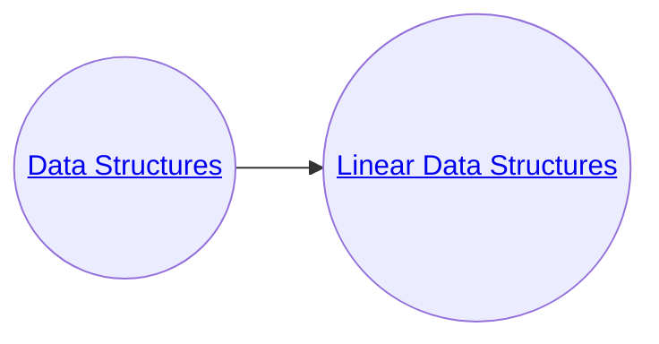

# Data Structures and Algorithms Fundamentals
#### This repo holds my [Data structure](https://softuni.bg/trainings/3922/data-structures-fundamentals-with-java-november-2022) and [Algorithms](https://softuni.bg/trainings/3811/algorithms-fundamentals-with-java-june-2022) Fundamentals courses at SoftUni.

## **Content of the repository**

### 1. [Data Structure Fundamentals ](Data-Structures)
   * [Linear Data Structures](Data-Structures/LinearDS/src)
   * [Exercise: Linear Data Structures](Data-Structures/LinearDS_Ex/src)
   * [Trees Representation and Traversal (BFS, DFS](Data-Structures/TreesRepresentation/src)
   * [Exercise: Trees Representation and Traversal (BFS, DFS)](Data-Structures/TreesRepresentation_Ex/src)
   * [Heaps, BST](Data-Structures/HeapsBST/src)

### 2. [Algorithms Fundamentals](Algorithms-Fundamentals)
* [Recursion and Backtracking](Algorithms-Fundamentals/src/recursionAndBacktraking)
* [Combinatorial Problems](Algorithms-Fundamentals/src/combinatorialProblems)
* Searching algorithms
  * [Binary search](Algorithms-Fundamentals/src/searchingAlgorithms/SearchingAlgorithms.java) implemented with while loop 
  * [Binary search](Algorithms-Fundamentals/src/BinarySearch.java) implemented with recursion
  * [Sorting algorithms](Algorithms-Fundamentals/src/sortingAlgorithms)

